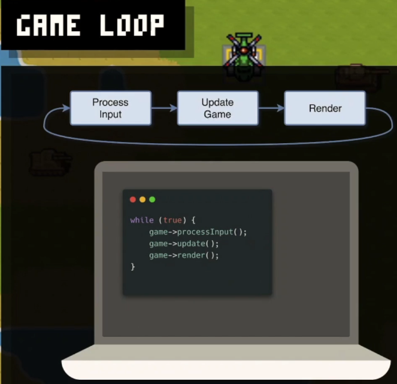

# Game Engine Notes

## Context

This doc contains some notes about the **udemy course** while I am listening

## Game Window

### Real time and Game Loop

- Real time : processing users input (pressing the mouse, keyboard,...), waiting for events,...
- Game Loop: in game loop, where 1 frame is processed, we have 3 main steps to perfrom as shown in [Figure 1](#fig1):
  1. process input from user
  2. update game: like motion and movements, velocity
    - In other words, we **update game objects**
  3. After finishing updates, we go to **rendering** stage
    - Basically we draw things on screen

<strong>Figure 1:</strong> Game loop steps

### Time Steps and FPS

Of course, every laptop and machine have different speed: some are fast and some are slow. So depending on the speed of our machine, we may experience faster or slower FPS. That's why later we see how to have a **consistent time steps** whatever machine we have.

- 

