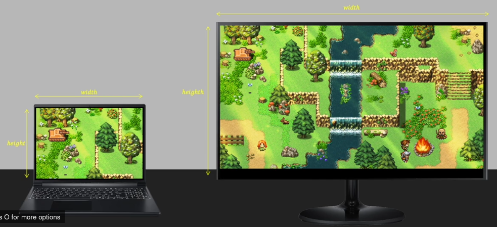

# Game Engine Notes

## Table of Contents

- [Game Engine Notes](#game-engine-notes)
  - [Table of Contents](#table-of-contents)
  - [Context](#context)
  - [Game Window](#game-window)
    - [Real time and Game Loop](#real-time-and-game-loop)
    - [Time Steps and FPS](#time-steps-and-fps)
  - [OOP benifits](#oop-benifits)
    - [TODO](#todo)
  - [Full Screen and Video mode](#full-screen-and-video-mode)

## Context

This doc contains some notes about the **udemy course** while I am listening

## Game Window

### Real time and Game Loop

- Real time : processing users input (pressing the mouse, keyboard,...), waiting for events,...
- Game Loop: in game loop, where 1 frame is processed, we have 3 main steps to perfrom as shown in [Figure 1](#fig1):
  1. process input from user
  2. update game: like motion and movements, velocity
    - In other words, we **update game objects**
  3. After finishing updates, we go to **rendering** stage
    - Basically we draw things on screen

<strong>Figure 1:</strong> Game loop steps

### Time Steps and FPS

Of course, every laptop and machine have different speed: some are fast and some are slow. So depending on the speed of our machine, we may experience faster or slower FPS. That's why later we see how to have a **consistent time steps** whatever machine we have.

## OOP benifits

- In `game.h`, the `private` section where we have our memeber variables, help us group our variables
- So instead declaring for example in `Game::init()` sevral struct variables like `SDL_DisplayMode display_mode`, we put in `private` section and directly start using variables inside the method `Game::init()`

### TODO

A nice thing to do later is to make a comparison
with OOP version and the `C` style projects from `C_Graphics` repository

## Full Screen and Video mode

When setting up our screen dimension, we have the function `SDL_SetWindowFullscreen(this->m_window,SDL_WINDOW_FULLSCREEN)`. The idea behind this function is to have a compatible view between all users having different screen resolution.

If we don't use the `SDL_SetWindowFullscreen()`, we will have something like in [Figure 2](#fig2): each user see a different view of the map details. The bigger screen will see more details.

<strong>Figure 2:</strong> Non compatible map view between users

But when using `SDL_SetWindowFullscreen()`, we will have a compatible view between all users as shown in [Figure 3](#fig3)

<strong>Figure 3:</strong> Compatible map view between users

