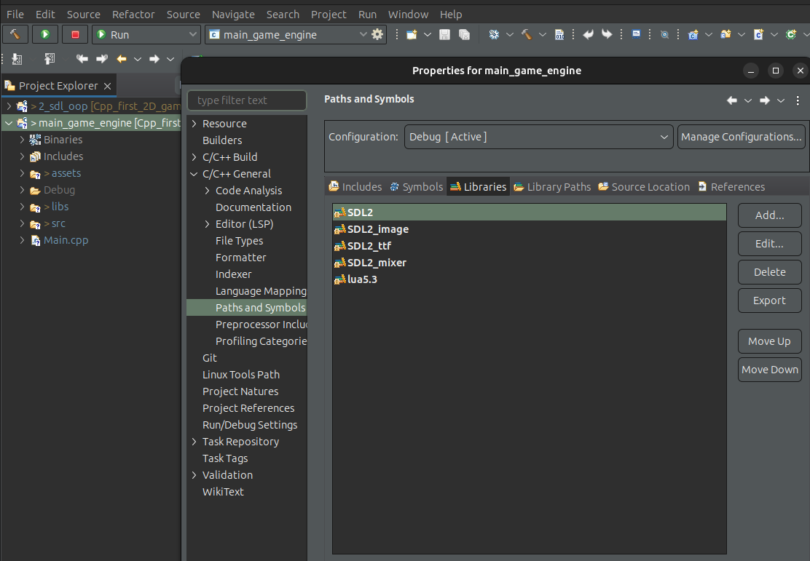
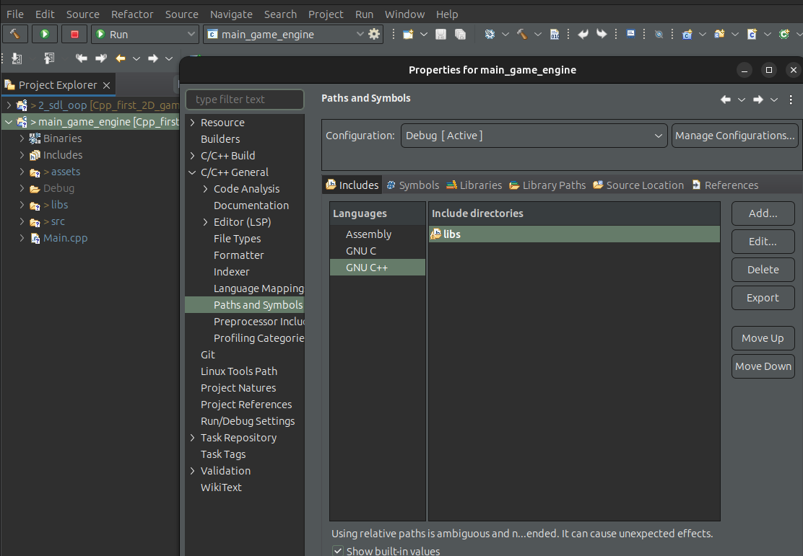
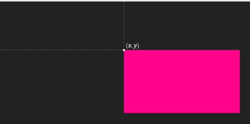
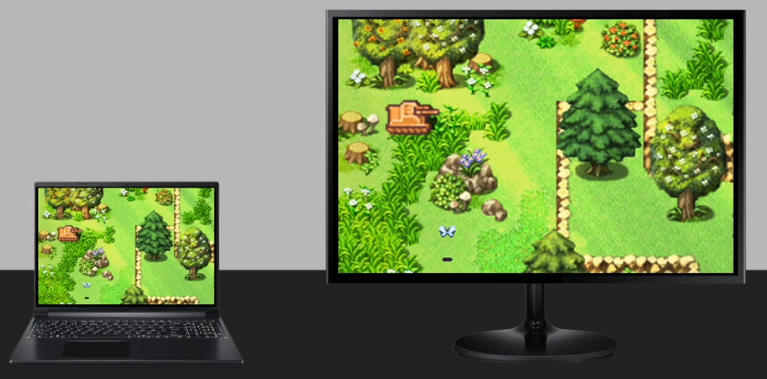
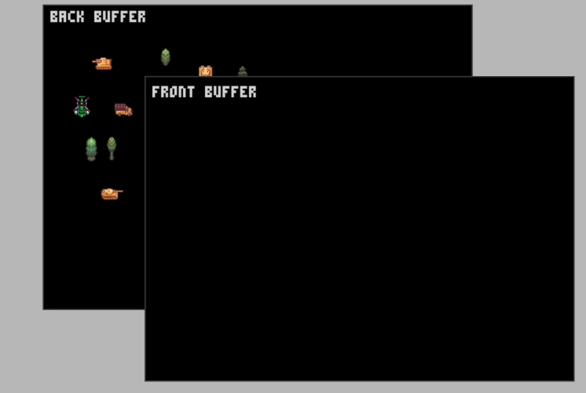
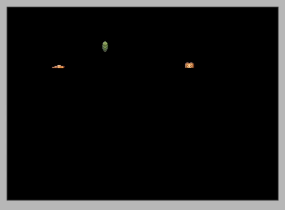

# Game Engine Notes

## Table of Contents

- [Game Engine Notes](#game-engine-notes)
  - [Table of Contents](#table-of-contents)
  - [Context](#context)
  - [Setting up Libraries in Eclipse](#setting-up-libraries-in-eclipse)
  - [Game Window](#game-window)
    - [Real time and Game Loop](#real-time-and-game-loop)
    - [Time Steps and FPS](#time-steps-and-fps)
  - [OOP benifits](#oop-benifits)
    - [TODO](#todo)
  - [Coordinate System](#coordinate-system)
  - [Full Screen and Video mode](#full-screen-and-video-mode)
  - [Back and Front Buffers](#back-and-front-buffers)

## Context

This doc contains some notes about the **udemy course** while I am listening

## Setting up Libraries in Eclipse

In **Eclipse**, we need to set 2 things:

1. The `SDL` libraries (audio,image,...)

The way we do that is: right click on project,
-> Properties -> C/C++ General -> Paths and Symbols
and we go to Libraries tab, and add all the SDL flags as shown 
[Figure SDL](#fig_sdl)

<strong>Figure SDL :</strong> Setting up SDL libraries

1. The headers of `libs` folder.

Now for the `libs` folder which contains the header of some libraries we use, these are headers and not shared libraries. So we need to inlcude these header in our project configuration

We follow the same steps as in [Figure SDL](#fig_sdl), but now we use the `Includes` tab and add the `libs` folder, as shown in [Figure libs](#fig_libs)

<strong>Figure libs:</strong> Adding header files

## Game Window

### Real time and Game Loop

- Real time : processing users input (pressing the mouse, keyboard,...), waiting for events,...
- Game Loop: in game loop, where 1 frame is processed, we have 3 main steps to perfrom as shown in [Figure 1](#fig1):
  1. process input from user
  2. update game: like motion and movements, velocity
    - In other words, we **update game objects**
  3. After finishing updates, we go to **rendering** stage
    - Basically we draw things on screen

<strong>Figure 1:</strong> Game loop steps

### Time Steps and FPS

Of course, every laptop and machine have different speed: some are fast and some are slow. So depending on the speed of our machine, we may experience faster or slower FPS. That's why later we see how to have a **consistent time steps** whatever machine we have.

## OOP benifits

- In `game.h`, the `private` section where we have our memeber variables, help us group our variables
- So instead declaring for example in `Game::init()` sevral struct variables like `SDL_DisplayMode display_mode`, we put in `private` section and directly start using variables inside the method `Game::init()`

### TODO

A nice thing to do later is to make a comparison
with OOP version and the `C` style projects from `C_Graphics` repository

## Coordinate System

In `SDL`, the cartesian coordinate follows a different approach then the traditianal one. The origin starts from the top left corner.

The directions are shown in [Figure 1 b)](#fig1b)

<strong>Figure 1 b:</strong> xy system

## Full Screen and Video mode

When setting up our screen dimension, we have the function `SDL_SetWindowFullscreen(this->m_window,SDL_WINDOW_FULLSCREEN)`. The idea behind this function is to have a compatible view between all users having different screen resolution.

If we don't use the `SDL_SetWindowFullscreen()`, we will have something like in [Figure 2](#fig2): each user see a different view of the map details. The bigger screen will see more details.

<strong>Figure 2:</strong> Non compatible map view between users

But when using `SDL_SetWindowFullscreen()`, we will have a compatible view between all users as shown in [Figure 3](#fig3)

<strong>Figure 3:</strong> Compatible map view between users

## Back and Front Buffers

`SDL` comes with the idea of double buffers: front and back.
In our code we use the following function: 

<pre>SDL_RenderPresent(this->m_renderer)</pre>

This is because the way `SDL` render things is it draws the object on the back buffer first as shown in [Figure 4](#fig4), then the function `SDL_RenderPresent()` make a **swap** between buffers: the front becomes back, and the back becomes front.

<strong>Figure 4:</strong> Back and Front buffers

If we use only 1 buffer, then we have some **glitches** and we start to see things in some progressive manner as shown in [Figure 5](#fig5)

<strong>Figure 5:</strong> 1 buffer only can cause gltiches

